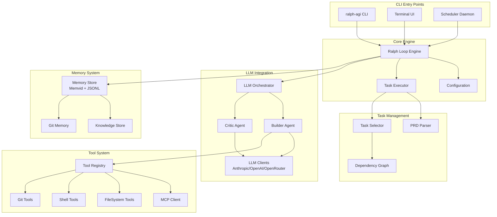

# RALPH-AGI Codebase Map

> Auto-generated by Cartographer. Last mapped: 2026-01-17

## System Overview

**RALPH-AGI** (Recursive Autonomous Long-horizon Processing with Hierarchical AGI-like Intelligence) is an autonomous AI agent framework for software development. It executes long-horizon tasks through a persistent loop with memory, tool integration, and multi-agent collaboration.



## Directory Structure

```
ralph-agi-001/
├── ralph_agi/              # Core Python package (~100k tokens)
│   ├── cli.py              # Main CLI entry point
│   ├── output.py           # Rich terminal output
│   ├── init_wizard.py      # Setup wizard
│   ├── interactive.py      # Interactive mode
│   ├── core/               # Loop engine & config
│   ├── llm/                # Multi-provider LLM integration
│   ├── memory/             # Memvid + JSONL memory system
│   ├── tasks/              # PRD parsing & task selection
│   ├── tools/              # MCP-based tool system
│   ├── scheduler/          # AFK mode & daemon
│   └── tui/                # Textual-based Terminal UI
├── tests/                  # Comprehensive test suite (~130k tokens)
│   ├── cli/                # CLI tests
│   ├── core/               # Loop & config tests
│   ├── integration/        # End-to-end tests
│   ├── llm/                # LLM client tests
│   ├── memory/             # Memory system tests
│   ├── tasks/              # Task management tests
│   ├── tools/              # Tool execution tests
│   └── tui/                # TUI widget tests
├── website/                # React documentation site (~70k tokens)
│   ├── src/pages/          # Page components
│   ├── src/components/     # Shared components
│   └── src/components/ui/  # Radix UI component library
├── docs/                   # Product documentation
├── rnd/                    # R&D artifacts (decisions, research)
├── _bmad-output/           # Implementation artifacts
├── demo/                   # Demo scenarios
├── .beads/                 # AI-native issue tracking
└── .claude/                # BMAD workflow commands
```

## Module Guide

### Core Engine (`ralph_agi/core/`)

**Purpose**: Main execution loop and configuration management

**Entry point**: `ralph_agi/cli.py`

| File             | Purpose                                 | Tokens |
| ---------------- | --------------------------------------- | ------ |
| `cli.py`         | Main CLI with argparse, command routing | 5,468  |
| `core/loop.py`   | Ralph Loop Engine - heart of the system | 8,686  |
| `core/config.py` | YAML config loading & validation        | 2,529  |
| `output.py`      | Rich terminal formatting                | 1,708  |
| `interactive.py` | Interactive mode with PRD wizard        | 2,355  |
| `init_wizard.py` | First-run setup wizard                  | 3,053  |

**Key Classes**:

- `RalphLoop` - Main execution loop with retry logic
- `RalphConfig` - Configuration dataclass with validation
- `ToolExecutorAdapter` - Bridges LLM tools to implementations
- `OutputFormatter` - Polished terminal output

**Critical Pattern**: WHILE loop (not FOR) for cleaner exit conditions

```python
while not complete and iteration < max_iterations:
    task = select_next_task()
    result = execute_with_retry(task)
    update_memory(result)
```

**Dependencies**: Tasks, LLM, Memory, Tools modules

---

### LLM Integration (`ralph_agi/llm/`)

**Purpose**: Multi-provider LLM support with Builder + Critic pattern

**Entry point**: `ralph_agi/llm/orchestrator.py`

| File              | Purpose                                | Tokens |
| ----------------- | -------------------------------------- | ------ |
| `orchestrator.py` | Coordinates Builder → Critic flow      | 3,269  |
| `agents.py`       | Builder & Critic agent implementations | 4,358  |
| `prompts.py`      | System prompts and helpers             | 2,987  |
| `anthropic.py`    | Claude API client                      | 2,077  |
| `openai.py`       | OpenAI GPT client                      | 2,946  |
| `openrouter.py`   | OpenRouter multi-model client          | 1,817  |
| `client.py`       | Abstract LLM client protocol           | 1,364  |
| `verification.py` | Syntax & import checking               | 1,602  |
| `evaluator.py`    | Acceptance criteria evaluation         | 2,561  |

**Key Classes**:

- `LLMOrchestrator` - Coordinates multi-agent flow
- `BuilderAgent` - Task execution with tool loop
- `CriticAgent` - Code review and quality assurance
- `AnthropicClient`, `OpenAIClient`, `OpenRouterClient` - Provider clients

**Flow**:

```
Orchestrator
    → BuilderAgent.execute() [tool loop until DONE]
    → CriticAgent.review() [APPROVED/NEEDS_REVISION/BLOCKED]
    → Verification [syntax, imports, tests]
    → Evaluator [acceptance criteria]
```

**Anti-hallucination**: Builder verifies files exist before marking complete

**Dependencies**: Tools module for execution, Memory for context

---

### Memory System (`ralph_agi/memory/`)

**Purpose**: Persistent memory with semantic search and crash resilience

**Entry point**: `ralph_agi/memory/store.py`

| File              | Purpose                              | Tokens |
| ----------------- | ------------------------------------ | ------ |
| `store.py`        | Main memory store (Memvid + JSONL)   | 5,168  |
| `knowledge.py`    | Knowledge extraction and storage     | 3,420  |
| `git.py`          | Git-based memory persistence         | 3,560  |
| `hooks.py`        | Memory lifecycle hooks               | 3,425  |
| `compaction.py`   | Context compaction for long sessions | 3,668  |
| `jsonl_backup.py` | JSONL fallback for crash safety      | 1,892  |

**Key Classes**:

- `MemoryStore` - Main interface with dual-write
- `MemoryFrame` - Single memory unit with metadata
- `KnowledgeStore` - Structured knowledge extraction
- `GitMemory` - Git-integrated persistence

**Features**:

- Semantic search via Memvid embeddings
- BM25 keyword search
- Hybrid search (combines both)
- JSONL backup for crash resilience
- Token budget truncation

**Gotchas**:

- Must call `close()` for proper cleanup
- Store path defaults to `ralph_memory.mv2`

---

### Task Management (`ralph_agi/tasks/`)

**Purpose**: PRD parsing, task selection, and dependency resolution

**Entry point**: `ralph_agi/tasks/executor.py`

| File          | Purpose                                  | Tokens |
| ------------- | ---------------------------------------- | ------ |
| `graph.py`    | Dependency graph with cycle detection    | 4,063  |
| `prd.py`      | PRD.json parser with validation          | 2,928  |
| `selector.py` | Priority-based task selection            | 1,989  |
| `executor.py` | Single-feature-per-iteration enforcement | 1,844  |
| `writer.py`   | PRD.json updates                         | 1,764  |

**Key Classes**:

- `PRD` - Frozen dataclass for project requirements
- `Feature` - Individual task with acceptance criteria
- `DependencyGraph` - DAG for task ordering
- `TaskSelector` - Priority + dependency resolution
- `TaskExecutor` - Thread-safe task locking

**PRD Schema**:

```json
{
  "project": { "name": "...", "description": "..." },
  "features": [
    {
      "id": "F-001",
      "description": "...",
      "priority": 1,
      "dependencies": ["F-000"],
      "acceptance_criteria": ["..."]
    }
  ]
}
```

**Single Task Constraint**: Only one task executes at a time to prevent context bloat

---

### Tool System (`ralph_agi/tools/`)

**Purpose**: MCP-based dynamic tool discovery and execution

**Entry point**: `ralph_agi/tools/registry.py`

| File            | Purpose                                              | Tokens |
| --------------- | ---------------------------------------------------- | ------ |
| `filesystem.py` | Safe file operations with security                   | 5,173  |
| `git.py`        | Git operations with workflow enforcement + worktrees | 5,674  |
| `mcp.py`        | Model Context Protocol client                        | 4,537  |
| `registry.py`   | Dynamic tool discovery                               | 3,692  |
| `executor.py`   | Tool execution with retries                          | 3,428  |
| `shell.py`      | Safe command execution                               | 2,934  |
| `schema.py`     | Tool schema definitions                              | 2,378  |
| `cache.py`      | Tool result caching                                  | 1,377  |

**Key Classes**:

- `ToolRegistry` - Multi-server tool discovery
- `FileSystemTools` - Read, write, edit with path security
- `ShellTools` - Command execution with timeout
- `GitTools` - Git operations with workflow modes + worktree isolation
- `WorktreeInfo` - Frozen dataclass for worktree metadata
- `MCPClient` - JSON-RPC 2.0 over stdio

**Security**:

- Path traversal prevention
- Allowed roots enforcement
- Command allowlist/blocklist
- Binary file detection

**Git Workflows**:

- `direct` - Commit anywhere (risky)
- `branch` - Create feature branches
- `pr` - Create branches + PRs via gh CLI

**Git Worktree Operations** (NEW):

- `worktree_add()` - Create isolated worktree for parallel task execution
- `worktree_list()` - List all worktrees with metadata
- `worktree_remove()` - Clean up worktree (supports force for dirty trees)
- `worktree_prune()` - Clean stale metadata from deleted worktrees

**Worktree Integration with TaskExecutor**:

```python
executor = TaskExecutor(
    enable_worktree_isolation=True,
    repo_path=Path("."),
    worktree_base=Path("../worktrees")
)
ctx = executor.begin_task(prd_path)
# Work in ctx.work_dir (isolated worktree)
# Branch: ctx.branch_name (e.g., "ralph/feature-123")
```

---

### Scheduler (`ralph_agi/scheduler/`)

**Purpose**: AFK mode with scheduled autonomous operation

| File        | Purpose                             | Tokens |
| ----------- | ----------------------------------- | ------ |
| `daemon.py` | Background daemon (launchd/systemd) | 3,726  |
| `hooks.py`  | Wake hooks (git_pull, check_deps)   | 2,481  |
| `cron.py`   | Cron expression parsing             | 1,487  |
| `config.py` | Scheduler configuration             | 1,207  |

**Platforms**: macOS (launchd), Linux (systemd)

**Wake Hooks**: Pre-execution checks before running loop

---

### Terminal UI (`ralph_agi/tui/`)

**Purpose**: Textual-based real-time monitoring interface

| File                      | Purpose                   | Tokens |
| ------------------------- | ------------------------- | ------ |
| `app.py`                  | Main Textual application  | 2,507  |
| `widgets/story_grid.py`   | Task status grid          | 1,369  |
| `widgets/metrics_bar.py`  | Real-time metrics display | 1,631  |
| `widgets/agent_viewer.py` | Agent output viewer       | 1,123  |
| `widgets/log_panel.py`    | Scrolling log panel       | 971    |

**Features**: Real-time monitoring, keyboard shortcuts, responsive layout

---

### Website (`website/`)

**Purpose**: React documentation site with Obsidian Vault theme

**Stack**: React 19, Vite, Tailwind CSS v4, Wouter, Framer Motion

| Directory            | Purpose                                         |
| -------------------- | ----------------------------------------------- |
| `src/pages/`         | Page components (Home, PRD, Architecture, etc.) |
| `src/components/`    | Layout, ErrorBoundary, Map                      |
| `src/components/ui/` | ~50 Radix UI components                         |
| `src/contexts/`      | Theme provider                                  |
| `src/hooks/`         | Custom hooks (useMobile, useComposition)        |

**Routing**: Wouter (lightweight SPA router)

- `/` - Home
- `/prd` - Product Requirements
- `/architecture` - Technical Architecture
- `/getting-started` - Installation Guide
- `/use-cases` - Real-World Applications
- `/enterprise` - Enterprise Waitlist

---

### Test Suite (`tests/`)

**Framework**: pytest with fixtures, mocks, async support

**Coverage**: 1327 tests, 90%+ coverage

| Directory            | Tests  | Focus                              |
| -------------------- | ------ | ---------------------------------- |
| `tests/cli/`         | CLI    | Argument parsing, command dispatch |
| `tests/core/`        | Loop   | Execution, config, AFK mode        |
| `tests/integration/` | E2E    | Full LLM-wired workflows           |
| `tests/llm/`         | LLM    | All provider clients, agents       |
| `tests/memory/`      | Memory | Store, search, compaction          |
| `tests/tasks/`       | Tasks  | PRD parsing, graph, selector       |
| `tests/tools/`       | Tools  | FS, shell, git, MCP                |

**Notable**: Security tests for path traversal, stress tests for reliability

---

## Data Flow

### Main Execution Flow

```mermaid
sequenceDiagram
    participant CLI
    participant Loop as RalphLoop
    participant Task as TaskExecutor
    participant Orch as Orchestrator
    participant Builder
    participant Critic
    participant Tools
    participant Memory

    CLI->>Loop: run(prd_path)
    Loop->>Memory: load_context()
    Loop->>Task: begin_task()
    Task->>Task: select_next_task()
    Task-->>Loop: ExecutionContext

    Loop->>Orch: execute(task)
    Orch->>Builder: execute(task, tools)

    loop Tool Loop
        Builder->>Tools: call_tool()
        Tools-->>Builder: result
    end

    Builder-->>Orch: BuilderResult
    Orch->>Critic: review(result)
    Critic-->>Orch: CriticResult
    Orch-->>Loop: OrchestratorResult

    Loop->>Task: complete_task()
    Loop->>Memory: store_result()

    alt All tasks complete
        Loop-->>CLI: Success
    else More tasks
        Loop->>Loop: next iteration
    end
```

### Memory Query Flow

```mermaid
sequenceDiagram
    participant Loop
    participant Store as MemoryStore
    participant Memvid
    participant JSONL

    Loop->>Store: query(filters)
    Store->>Memvid: search_hybrid()
    Memvid-->>Store: frames
    Store->>Store: apply_filters()
    Store->>Store: truncate_to_budget()
    Store-->>Loop: MemoryQueryResult

    Note over Store,JSONL: Dual-write on append
    Loop->>Store: append(frame)
    Store->>Memvid: add_frame()
    Store->>JSONL: append_backup()
```

---

## Conventions

### Code Style

- **Python**: snake_case functions, PascalCase classes, UPPER_CASE constants
- **TypeScript**: camelCase functions, PascalCase components
- **Frozen Dataclasses**: Immutable data structures throughout

### Configuration

- `config.yaml` - Runtime configuration
- `PRD.json` - Task definitions (single source of truth)
- `.env` - API keys (never committed)

### Git Workflow

- Default branch: `main`
- Feature branches: `ralph/feature-name`
- Protected branches enforced

### Testing

- Unit tests in module subdirectories
- Integration tests in `tests/integration/`
- Fixtures for isolation
- Mocks for external services

---

## Gotchas

### Critical

1. **Max Iterations**: Loop stops at limit, not on completion signal
2. **Git Branch Detection**: Must check for default branch (don't assume "main")
3. **Tool Verification**: Files verified for syntax before marking complete
4. **Anti-Hallucination**: Builder forbidden from outputting fake data
5. **Memory Fallback**: Automatic JSONL fallback if Memvid unavailable

### Important

6. **Single Task Lock**: Only one task executes at a time
7. **Critic Failures**: Don't fail task; fall back to COMPLETED_NO_REVIEW
8. **Token Budget**: Query results truncated to fit max_tokens
9. **Path Security**: All file operations check for traversal attacks
10. **Shell Timeout**: Strict 60s timeout (configurable)

### Subtle

11. **PRD Immutability**: Frozen dataclasses prevent accidental modification
12. **MCP Cleanup**: Must explicitly close for proper resource cleanup
13. **Builder Max Iterations**: If Builder hits limit, Critic is NOT run
14. **Binary Detection**: UTF-8 enforced; binary files throw errors
15. **WHILE not FOR**: Loop uses while for cleaner exit conditions

### Worktree Operations

16. **Branch Conflict**: Cannot create worktree for branch already checked out elsewhere
17. **Path Existence**: worktree_add() fails if target path exists (even empty directories)
18. **Relative Path Resolution**: Relative worktree paths resolve against repo_path, not CWD
19. **Cleanup Required**: Use worktree_remove(), not manual deletion (then prune stale metadata)
20. **is_main Detection**: First worktree in list is always the main worktree

---

## Navigation Guide

**To add a new CLI command**:

1. `ralph_agi/cli.py` - Add to argument parser
2. Implement handler function
3. `tests/cli/test_cli.py` - Add tests

**To add a new LLM provider**:

1. `ralph_agi/llm/` - Create new client (follow `client.py` protocol)
2. `ralph_agi/llm/__init__.py` - Export client
3. `ralph_agi/core/loop.py` - Add to client factory
4. `tests/llm/` - Add provider tests

**To add a new tool**:

1. `ralph_agi/tools/` - Create tool class
2. `ralph_agi/tools/registry.py` - Register tool
3. `ralph_agi/core/loop.py` - Add to ToolExecutorAdapter
4. `tests/tools/` - Add tool tests

**To add a new memory feature**:

1. `ralph_agi/memory/` - Implement feature
2. `ralph_agi/memory/store.py` - Integrate with MemoryStore
3. `tests/memory/` - Add tests

**To add a website page**:

1. `website/src/pages/` - Create page component
2. `website/src/App.tsx` - Add route
3. `website/src/components/Layout.tsx` - Add to navigation

**To add a demo scenario**:

1. `demo/scenario-N-name/` - Create directory
2. Add `PRD.json`, `config.yaml`
3. `demo/README.md` - Document scenario

**To enable worktree isolation for parallel tasks**:

1. `ralph_agi/tasks/executor.py` - Set `enable_worktree_isolation=True`
2. Configure `worktree_base` path for isolated working directories
3. Tasks auto-create branches: `ralph/<task-id>`
4. Worktrees preserved after completion for merge review

---

## Configuration Reference

### Environment Variables

```bash
ANTHROPIC_API_KEY=sk-ant-...    # Required for Claude
OPENAI_API_KEY=sk-...           # Required for OpenAI
OPENROUTER_API_KEY=sk-or-...    # Required for OpenRouter
```

### config.yaml

```yaml
max_iterations: 100
checkpoint_interval: 1
completion_promise: "<promise>COMPLETE</promise>"

memory:
  enabled: true
  store_path: "ralph_memory.mv2"

llm:
  builder_provider: "anthropic"
  builder_model: "claude-sonnet-4-20250514"
  critic_provider: "openai"
  critic_model: "gpt-4o"
  max_tokens: 4096
  temperature: 0.0

git:
  workflow: "branch"
  protected_branches: ["main", "master"]
  branch_prefix: "ralph/"
  auto_push: true
```

### PRD.json Schema

```json
{
  "project": {
    "name": "string (required)",
    "description": "string (required)",
    "version": "string (optional)"
  },
  "features": [
    {
      "id": "string (required)",
      "description": "string (required)",
      "passes": "boolean (required)",
      "category": "functional|ui|performance|security|integration",
      "priority": "0-4 (0=highest)",
      "steps": ["array of strings"],
      "acceptance_criteria": ["array of strings"],
      "dependencies": ["array of feature IDs"],
      "completed_at": "ISO timestamp or null"
    }
  ]
}
```

---

## Quick Commands

```bash
# Installation
./install.sh

# Run with PRD
./run-ralph.sh run --prd PRD.json

# Interactive mode
./run-ralph.sh

# Terminal UI
./run-ralph.sh tui --prd PRD.json

# Dry run (no LLM calls)
./run-ralph.sh run --prd PRD.json --dry-run

# Run tests
python3 -m pytest

# Run with coverage
python3 -m pytest --cov=ralph_agi

# Issue tracking
bd create "Task description"
bd list --status open
bd sync
```
