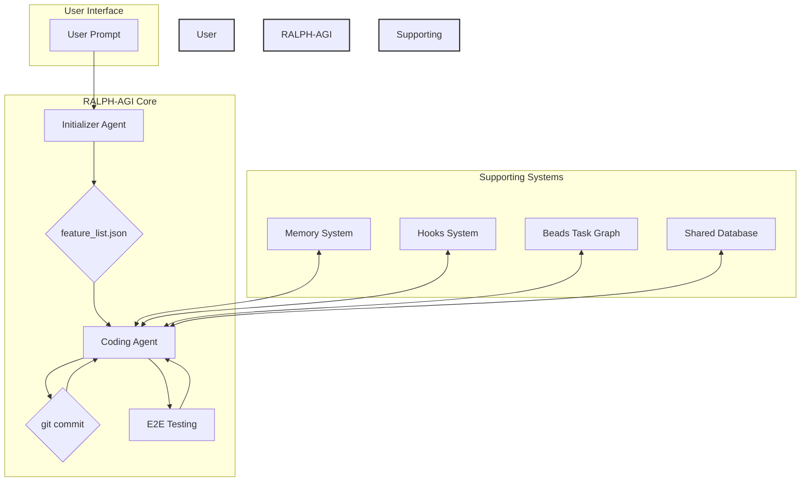
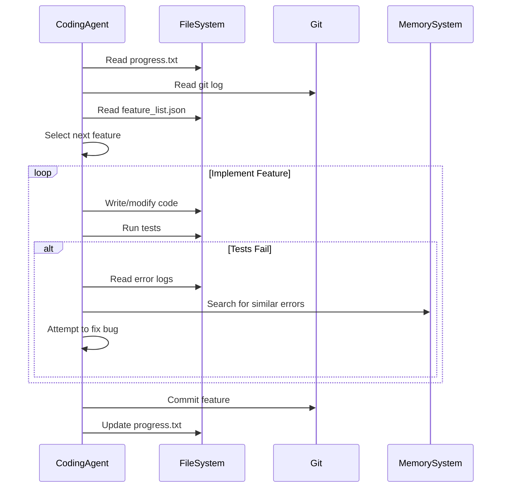

# RALPH-AGI: Technical Architecture

**Version:** 1.0  
**Date:** Jan 10, 2026  
**Author:** Manus AI

---

## 1. System Architecture Overview

RALPH-AGI is a multi-agent, event-driven system designed for long-horizon task completion. It is built on a foundation of simple, robust patterns that have been validated in production environments. The architecture is designed to be modular, extensible, and resilient.

### 1.1. Core Principles

- **Simplicity over Complexity:** Simple loops with strong feedback are more effective than complex orchestration frameworks.
- **Persistence Wins:** The agent's ability to iterate relentlessly is its primary advantage.
- **Memory is Power:** A multi-layered memory system enables the agent to learn and improve over time.
- **Event-Driven Automation:** A hooks system allows for proactive, automated behaviors at key lifecycle points.

### 1.2. High-Level Architecture Diagram



**Diagram Description:** The user provides a prompt to the **Initializer Agent**, which creates a `feature_list.json`. The **Coding Agent** then works on one feature at a time, interacting with the **Memory System**, **Hooks System**, **Beads Task Graph**, and **Shared Database**. It performs **E2E Testing** and creates a `git commit` for each completed feature, then loops back to the next feature.

---

## 2. Component Breakdown

### 2.1. Agents

| Agent | Description | Responsibilities |
| :--- | :--- | :--- |
| **Initializer Agent** | Sets up the project environment and task list. Runs only once at the beginning of a task. | - Expands the user prompt into a detailed `feature_list.json`.
- Creates the `progress.txt` file.
- Initializes the git repository.
- Sets up the `init.sh` script. |
| **Coding Agent** | The workhorse of the system. Iterates through the feature list and implements them one by one. | - Reads `progress.txt` and git logs to understand the current state.
- Selects the next feature to work on.
- Writes and modifies code.
- Runs tests and debugs errors.
- Commits completed features to git. |
| **Specialized Agents** | Domain-specific agents that can be invoked by the Coding Agent for specific tasks. | - **Testing Agent:** Writes and runs unit, integration, and E2E tests.
- **QA Agent:** Performs quality assurance checks on code and functionality.
- **Code Cleanup Agent:** Refactors code and improves readability.
- **TrendScout Agent:** Monitors for trending topics (for marketing use cases). |

### 2.2. Supporting Systems

| System | Description | Technology |
| :--- | :--- | :--- |
| **Memory System** | A multi-layered system for persistent memory. | - **Short-Term:** Context window
- **Medium-Term:** SQLite database
- **Long-Term:** ChromaDB vector store |
| **Hooks System** | An event-driven system for automating behaviors at key lifecycle points. | Custom implementation inspired by Continuous-Claude-v3 |
| **Beads Task Graph** | A dependency-aware task management system. | Inspired by Google's Blaze/Bazel |
| **Shared Database** | A central database for asynchronous multi-agent coordination. | SQLite |

---

## 3. Data Flow & State Management

### 3.1. State Management

- **Git is the single source of truth for code.** Every feature is committed to a separate branch.
- **`feature_list.json` tracks the overall task list.**
- **`progress.txt` provides a high-level summary of the current session's progress.**
- **The SQLite database stores structured data for multi-agent coordination.**

### 3.2. Data Flow Diagram (Coding Agent Loop)



---

## 4. Technology Stack

| Layer | Technology | Rationale |
| :--- | :--- | :--- |
| **Language** | Python | Rich ecosystem of AI/ML libraries, easy to script. |
| **LLM** | Claude 4.5 / GPT-4.1 | Frontier models with large context windows and strong reasoning. |
| **Database** | SQLite, ChromaDB | SQLite for structured data, ChromaDB for vector search. |
| **Version Control** | Git | Industry standard, provides robust state management. |
| **Browser Automation** | Puppeteer (via MCP-CLI) | For E2E testing and web interaction. |
| **Deployment** | Docker | For packaging and deploying the agent. |

---

## 5. Implementation Guide

### 5.1. Development Environment Setup

1.  Clone the `ralph-agi-001` repository from GitHub.
2.  Install Python 3.11+.
3.  Create a virtual environment: `python -m venv .venv`
4.  Activate the virtual environment: `source .venv/bin/activate`
5.  Install dependencies: `pip install -r requirements.txt`
6.  Set up environment variables for API keys (OpenAI, Anthropic, etc.) in a `.env` file.

### 5.2. Running the Agent

```bash
python main.py --prompt "Create a new Flask app with a single endpoint that returns 'Hello, World!'"
```

### 5.3. Adding a New Skill

1.  Create a new Python file in the `skills/` directory.
2.  Define a function that takes the necessary arguments and returns a string.
3.  Add a docstring to the function that describes what it does in natural language.
4.  The agent will automatically discover and index the new skill.

---

## 6. API Specification

(To be detailed in a separate document: `RALPH-AGI-API-SPECIFICATION.md`)
